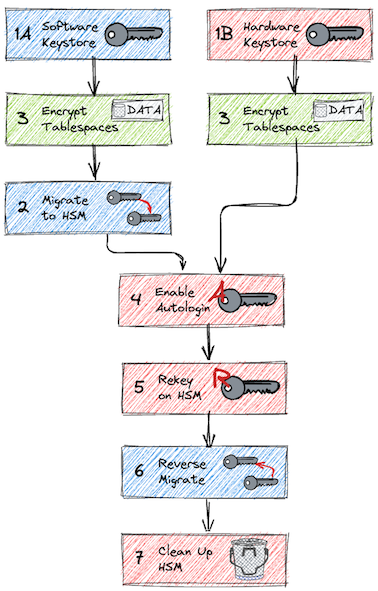

# 📘 TDE Use Case Documentation

This folder provides hands-on technical guides for implementing and operating Oracle Transparent Data Encryption (TDE) using both **software-based keystores** and **Hardware Security Modules (HSM)**.

Each use case is structured for DBAs and engineers to test, validate, and implement Oracle TDE across typical lifecycle operations including setup, migration, rekeying, and cleanup.

> 🧭 Use this flowchart to navigate valid paths starting from either a software or hardware keystore.

## 🔰 Start Points

To begin with TDE, choose one of the following initial configurations:

* **[1A. Software Keystore](tde_software_keystore.md)** — use this if TDE is already enabled with a file-based wallet (most common for existing environments).
* **[1B. Hardware Keystore](tde_hardware_keystore.md)** — start directly with HSM-backed encryption if this is a greenfield implementation.

## 🔀 Use Cases (Based on Starting Point)

### 🗂 Use Cases When Starting with a Software Keystore

| Document                                                                  | Description                                                                   |
| ------------------------------------------------------------------------- | ----------------------------------------------------------------------------- |
| [2. Migrate to HSM](tde_hsm_migration.md)                                 | Migrate the TDE master key from software keystore to HSM                      |
| [3. Encrypt Tablespaces Online](tde_enc_tablespace.md)                    | Encrypt existing or new tablespaces online                                    |
| [4. Enable Auto-Login for HSM](tde_hsm_autologin.md)                      | Configure auto-login by storing the HSM password in the local SEPS wallet     |
| [5. Rekey on HSM](tde_hsm_rekey.md)                                       | Generate a new master encryption key directly on the HSM                      |
| [6. Reverse Migration to Software Keystore](tde_hsm_reverse_migration.md) | Move master key back to software wallet (fallback or cleanup)                 |
| [7. Clean Up HSM Partition](tde_hsm_cleanup.md)                           | Delete unused or orphaned TDE keys from the HSM partition using `pkcs11-tool` |

### 🗂 Use Cases When Starting with a Hardware Keystore

| Document                                                                  | Description                                                                   |
| ------------------------------------------------------------------------- | ----------------------------------------------------------------------------- |
| [3. Encrypt Tablespaces Online](tde_enc_tablespace.md)                    | Encrypt existing or new tablespaces online                                    |
| [4. Enable Auto-Login for HSM](tde_hsm_autologin.md)                      | Configure auto-login by storing the HSM password in the local SEPS wallet     |
| [5. Rekey on HSM](tde_hsm_rekey.md)                                       | Generate a new master encryption key directly on the HSM                      |
| [6. Reverse Migration to Software Keystore](tde_hsm_reverse_migration.md) | Move master key back to software wallet (fallback or cleanup)                 |
| [7. Clean Up HSM Partition](tde_hsm_cleanup.md)                           | Delete unused or orphaned TDE keys from the HSM partition using `pkcs11-tool` |

## 📋 What's Included in Each Use Case

* 📜 Copy/paste-ready SQL and shell commands
* 🧩 Step-by-step configuration logic
* ⚙️ Tips for RAC, CDB/PDB, or production deployments
* ⚠️ Explicit warnings on irreversible/dangerous actions

> 🛠 These guides are modular and reusable — adapt them to your TDE lifecycle or lab automation pipelines.

## 📌 Special Topics - Further Consideration Required

The following advanced scenarios require additional planning or testing and are currently not fully documented:

* **Oracle RAC Environments**: Multi-node wallet configuration, password propagation, shared storage implications
* **Oracle Data Guard**: Key transport between primary and standby, wallet sync, redo apply with encrypted data
* **Database Cloning**: Behavior of wallet/key cloning in hot/cold clones or PDB-level clones
* **Database Backup and Restore**: Recovery scenarios when encryption keys are not auto-available; RMAN key handling
* **Keystore Backup Strategy**: Software wallet vs. HSM-native backup tools, when to snapshot vs. export keys

The document [Oracle TDE ADMINISTER KEY MANAGEMENT Command Reference](tde_command_reference.md) is a first attempt to better break down the possibilities of ADMINISTER KEY MANAGEMENT in connection with the different keystores.

> 🧠 These areas often require environment-specific implementation. Reach out to your Oracle Security Architect or test in a non-production environment before proceeding.
